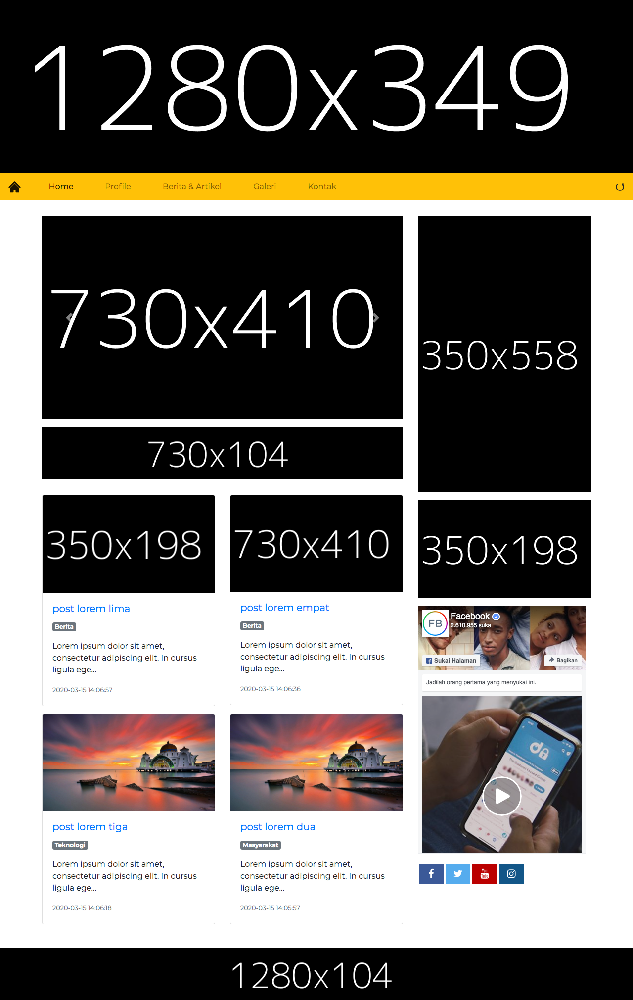

# La-Blog
> An simple laravel blog

![La Blog][la-blog]
![Version][version]

La-Blog is a simplest blog website that include an gallery into it, it suitable to who want to make a blog for taking an follower or to promote a product. La-Blog was made with Laravel 5.8 and Bootstrap 4.



## Installation

Clone this repository or go to [release](https://github.com/aziyan99/la-blog/releases) page, and then go to terminal and type following command to install the depedencies.
```sh
composer install
```
Dont forget to edit .env file with your database configuration, if .env file doesnt exist make a new one and copy the code from env.example file then edit it with your database credentials.
Then you have to migrate the database and seed some database to get La-Blog up and running
```sh
php artisan migrate
php artisan db:seed SettingsTableSeeder
```
At last, you must go to App > Providers > AppServiceProvider.php and uncomment the following code.
```sh
/**
     * Bootstrap any application services.
     *
     * @return void
     */
    public function boot()
    {
        //$settings = Setting::where('id', 1)->first();
        //view::share('setting', $settings);
    }
```
Optionally you can generate new key with
```sh
php artisan key:generate
```

## Usage example
To run La-Blog you just simply type in your terminal 
```sh
php artisan serve
```
Open your browser and go to provied link in terminal.
Admin dashboard link at 
```sh
http://yoururl:yourport/login
```
With credential
```sh
Email   : admin@admin.com
Pass    : admin
```
## Contributing

1. Fork it
2. Create your feature branch (`git checkout -b feature/fooBar`)
3. Commit your changes (`git commit -am 'Add some fooBar'`)
4. Push to the branch (`git push origin feature/fooBar`)
5. Create a new Pull Request

## Special Thanks
1. Laravel
2. Bootstrap

<!-- Markdown link & img dfn's -->
[la-blog]: https://img.shields.io/badge/La--Blog-Simplest%20Blog-yellow
[version]: https://img.shields.io/badge/Version-v1.0.0-blue